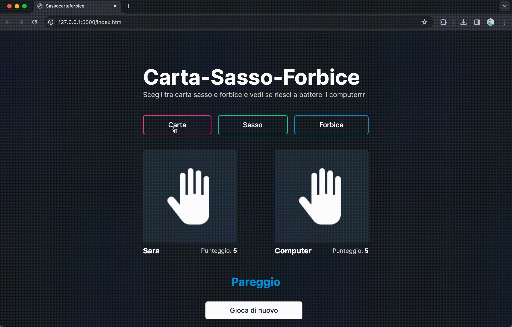

# Carta, Sasso, Forbice Game

Il gioco è stato implementato utilizzando HTML, JavaScript e Tailwind CSS per l'interfaccia utente. Consente all'utente di fare una scelta tra Carta, Sasso e Forbice e confronta questa scelta con quella generata casualmente dal computer. Il punteggio viene aggiornato di conseguenza, e la partita continua finché uno dei giocatori raggiunge lo zero punti.

## Video Dimostrativo

Puoi vedere una breve dimostrazione del gioco nel video qui sotto:

## Come Funziona

1. **Scelta Utente:** L'utente può fare la propria scelta cliccando sui pulsanti per Carta, Sasso o Forbice.
2. **Generazione Scelta Computer:** Il computer genera casualmente una scelta tra Carta, Sasso e Forbice.
3. **Confronto delle Scelte:** Le scelte dell'utente e del computer vengono confrontate per determinare il vincitore o se la partita è in pareggio.
4. **Aggiornamento del Punteggio:** Il punteggio dell'utente e del computer viene aggiornato di conseguenza.
5. **Fine Partita:** Se uno dei giocatori raggiunge lo zero punti, la partita termina e viene visualizzato il risultato finale.
6. **Reset:** È possibile azzerare il punteggio cliccando sul pulsante di reset.

## Tecnologie Utilizzate

- **HTML:** La struttura della pagina web.
- **JavaScript:** La logica del gioco e l'interazione con gli elementi HTML.
- **Tailwind CSS:** Utilizzato per lo stile e la formattazione dell'interfaccia utente.

## Istruzioni per l'Utilizzo

1. **Inserimento dell'Username:** All'inizio, l'utente viene chiesto di inserire il proprio username.
2. **Scelta del Giocatore:** Cliccare sui pulsanti "Carta", "Sasso" o "Forbice" per fare la propria scelta.
3. **Visualizzazione Risultati:** I risultati della partita e il punteggio vengono visualizzati nella sezione corrispondente.
4. **Fine Partita:** Se uno dei giocatori raggiunge lo zero punti, la partita termina e viene mostrato il risultato finale.
5. **Reset:** Cliccare sul pulsante di reset per azzerare il punteggio e iniziare una nuova partita.

## Riferimenti

- **Tailwind CSS:** [Documentazione di Tailwind CSS](https://tailwindcss.com/docs)

Divertiti a giocare a Carta, Sasso, Forbice! 🎮✨
